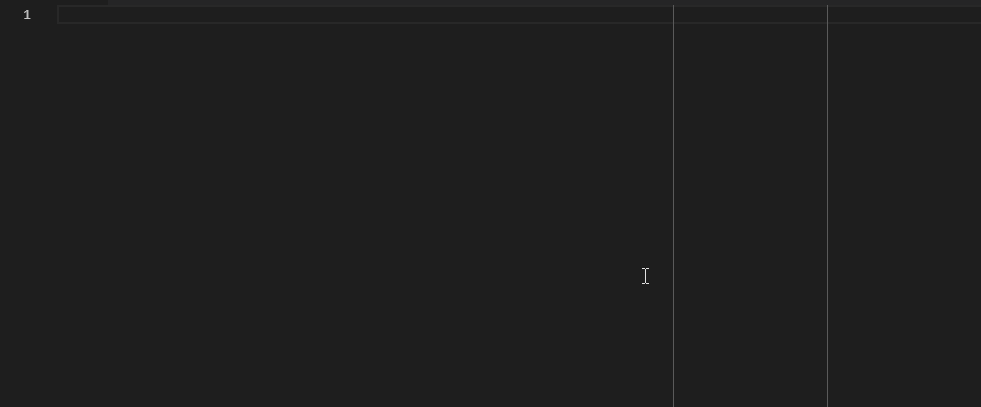

# Validate Typescript

Simple and extensible schema based validator with support for typescript typing.




<!---->


<!---->
<!---->


## Getting Started

The example below represents a basic subset of the inline validations that can be applied.

### Example

```ts
import { Email, ID, RegEx, Type, Options, Optional, Nullable, Alias, Any, All, validate } from 'validate-typescript';

function ZaPhoneNumber() {
    return Alias(RegEx(/^((\+27|0)\d{9})$/), ZaPhoneNumber.name);
}

class CustomMessage {
    constructor(public message: string) {}
}

const schema = {
    id: ID(),
    children: [ID()],
    username: Type(String),
    email: Email(),
    gmail: RegEx(/.+@gmail.com/),
    phone: ZaPhoneNumber(),
    gender: Options(['m', 'f', 'o']),
    married: Type(Boolean),
    names: {
        first: Type(String),
        middle: Optional(Type(String)),
        last: Type(String)
    }
    message: Type(CustomMessage)
}

const input = {
    id: 17,
    children: [1,2,'3'],
    username: 'solomon',
    email: 'solomon@validate-typescript.com',
    gmail: 'solomon@gmail.com',
    phone: '+27824392186'
    gender: 'm',
    married: true,
    names: {
        first: 'Solomon',
        last: 'Dube',
    }
    message: new CustomMessage('Sawubona Mhlaba')
}

try {
    const input = validate(schema, input);
    console.log(input); // no validation error
} catch (error) {
    console.log(error); // validation error
}
```

## Installation

```
npm install validate-typescript
```

## Imports

The default import provides `validate`, all the `validators` and all the `extensions`:

```ts
import { ... } from 'validate-typescript';
```

## Validators

The following examples of `validate-typescript` schemas illustrate the different validation methods.

**Note:** the comment `// type: TypeName` following the validator explicitly specifies the resultant typescript type inferred by the typescipt transpiler. This relates back to the *strongly typed* criteria.

## Type Validators

Expects an exact type match.

```ts
let schema = {
    myNumber: Type(Number),      // type: Number
    myString: Type(String),      // type: String
    myCustom: Type(CustomClass), // type: CustomClass
    // etc...
}
```

### Primitive Validators

Expects an exact primitive type match.

```ts
let schema = {
    myNumber: Primitive(Number),      // type: number
    myString: Primitive(String),      // type: string
    // etc...
}
```

### Literal Validators

Expects an exact type and value match.

```ts
let schema = {
    number49:    49,              // type: number
    myCountry:   'South Africa',  // type: string
    dontDefine:  undefined,       // type: undefined
    allwaysNull: null,            // type: null
    // etc...
}
```

### Custom (Extension) Validators

Expects custom convertions and assertions to be valid.

```ts
let schema = {
    myEmail:  Email(),      // type: string
    sqlId:    ID(),         // type: number
    comeText: RegEx(/abc/), // type: string
    // etc...
}
```

### Nested Object Validators

Expects a nested object that matches the nested schema.

```ts
let schema = {
    subObject: {
        a: ID(),
        b: Type(Date)
        c: {
            d: RegEx(/.+@gmail.com/)
        }
    } // type: { a: number, b: Date, c: { d: string } }
}
```

### Array Validators

Expects an array that matches the contents of the array schema.

**Note:** Multiple validators in the array are treated as boolean-or ([any](#any-or-all-validators)).

```ts
let schema = {
    // array validation
    emailArray: [Email()]             // type: string[]
    idArray: [ID()]                   // type: number[]

    // array with multiple options validation
    arrayOfEmailOrId: [Email(), ID()] // type: (string | number)[]
}
```

### Options Validators

Expects [any](#any-or-all-validators) or [all](#any-or-all-validators) of the validation options to match.

```ts
let schema = {
    // options validation
    options: Options([Type(Number), Type(String)]) // type: number | string

    // optional validation (i.e. not required)
    optional: Optional(ID())                       // type: number | undefined
    alsoOptional: Options([ID(), undefined])       // type: number | undefined

    // nullable validation
    maybeNull: Nullable(Type(String)),             // type: String | null
    alsoMaybeNull: Options([Type(String, null)]),  // type: String | null

    // array options
    arrayOptions: Options([[Email()], [ID()]])     // type: string[] | number[]
}
```

### Any or All Validators

Any represents boolean-or of the validation options while all represents boolean-and.

```ts
let schema = {

    // validate any options
    anyOptions: Options([Type(Number), Type(String)], ValidationOptions.any)     // type: number | string
    alsoAny: Any([Type(Number), Type(String)])                                   // type: number | string

    // validate all options
    allOptions: Options([RegEx(/.+@gmail.com/), Email()], ValidationOptions.all) // type: number | string
    alsoAll: All([RegEx(/.+@gmail.com/), Email()])                               // type: number | string
}
```
### Validation

**Note:** the return of `validate`, in this case `input`, will inherit the typescript typing of the schema, thus strongly-typed.

```ts
try {
    const input = validate(schema, input);
    console.log(input); // no validation error
} catch (error) {
    console.log(error); // validation error
}
```

### Assertions

Assertions allow enforcing of basic validation conditions and form the atomic building blocks of custom validators. Upon failure, assertions throw an `AssertionError`.

**Note:** All assertions take a flag allowing conditional inversion.

Assertions are intended to be extended.

#### Typed Assertions

|Assertion|Description|
|:-|:-|
|isSameType|Assert type equality of two inputs.|
|isSameTypeName|Asserts type name equality of two inputs.|
|isSymbol|Asserts symbol type input.|
|isBoolean|Asserts boolean type input.|
|isString|Asserts string type input.|
|isNumber|Asserts number type input.|
|isArray|Asserts array type input.|
|isNull|Asserts null type input.|
|isObject|Asserts object type input.|
|isUndefined|Asserts undefined type input.|

#### Numeric Assertions

|Assertion|Description|
|:-|:-|
|isInt|Asserts integer input.|
|isFloat|Asserts float input.|

#### Operational Assertions

|Assertion|Description|
|:-|:-|
|isEqualTo|Asserts equality (==) of two inputs.|
|isGreaterThan|Asserts greater than relation (>) of two inputs.|
|isLessThan|Asserts less than relation (<) of two inputs.|
|isGreaterThanOrEqualTo|Asserts greater than or equal to relation (>=) of two inputs.|
|isLessThanOrEqualTo|Asserts less than or equal to relation (<=) of two inputs.|

#### Misc Assertions

|Assertion|Description|
|:-|:-|
|isEqual|Asserts typed equality (===) of two inputs.|
|isRegEx|Asserts RegExp matching input.|

### Converters

All converters attempt to convert the input to a specific type and throw a `ConversionError` if the conversion fails.

Converters are intended to be extended.

|Conversion|Output Type|Input Types|Description|
|:-|:-:|:-:|:-|
|toInt| `number` | `number`, `string` |Converts only integers (needs updating)|
|toNumber| `number` | `number`, `string` |Converts any number|
|toBoolean| `boolean` | `boolean`, `string` |Converts 'true' and 'false' (needs updating)|

### Errors

Custom validation errors are implemented. It is ulikely that you will need to extend these but there may be future extensions.

- **ValidationError:** Abstract base class for all validation errors.
- **ConversionError:** Type of all the conversion errors.
- **AssertionError:** Type of all the assertion errors.
- **ValidationError:** Type of all the validation errors.
- **NotMatchAnyError:** Type of error thrown when `Any` does not match any of the provided validation options.

For example, supporting JSON formatted validation errors for easier parsing and logging.

### Custom Validators (Extensions)

Validators can be customized using converters, assertions as well as other custom validators (extensions). Upon failure, validators throw a `ValidationError`.

#### Alias

Aliasing is a method of aliasing a custom validator, possibly with inputs.

```ts
import { RegEx, Alias } from 'validate-typescript';

export function ZaPhoneNumber() {
    return Alias(RegEx(/^((\+27|0)\d{9})$/), ZaPhoneNumber.name);
}
```

#### ID

This example illustrates the use of both a converter and an assertion.

```ts
import { Validator } from 'validate-typescript';
import * as convert from 'validate-typescript/conversions';

export function ID() {
    return Validator((input: any): number => {
        const value = convert.toInt(input);
        assert.isGreaterThan(0, value);
        return value;
    }, ID.name);
}
```

#### RegEx

This example illustrates only the use of assertions.

```ts
import { Validator } from 'validate-typescript';
import * as assert from 'validate-typescript/assertions';

export function RegEx(regEx: RegExp) {
    return Validator((input: any): string => {
        assert.isString(input);
        assert.isRegEx(regEx, input);
        return input;
    }, RegEx.name);
}
```
